# Éducatifs natation : animations SVG

Animations autonomes (SVG + SMIL, sans script) : elles se lisent dans un navigateur, une balise `` ou sur GitHub.
Chaque animation montre :

- le mouvement sous un ou plusieurs angles (côté, face, 3/4, dessus) ;
- une frise de vignettes, une par phase clé, qui s'allume quand la phase est jouée ;
- le nom et la description de la phase en cours, avec une barre de progression ;
- les muscles sollicités, qui s'illuminent sur le corps en fonction de leur activation (jauges dans la légende).

Le style suit la DA de CoachLM : accent `#f3722c`, indigo `#2c3e50`, gris `#f8f9fa`/`#e9ecef`, police Inter, rayons de 5px et thème sombre automatique (`prefers-color-scheme`).

| Éducatif | Fichier |
| --- | --- |
| Battements de jambes avec planche |  |
| Crawl rattrapé |  |
| Battements sur le côté + respiration |  |
| Godille avant |  |

## Régénérer

```sh
pip install shapely
python3 generate.py        # tous les exercices
python3 generate.py 02     # un seul exercice
```

- `model.py` : le nageur 3D. Squelette articulé, chaque partie du corps est un volume à sections elliptiques (épaules, mollets, quadriceps…).
- `exercises.py` : la cinématique, les phases, les muscles et les conseils de chaque éducatif.
- `render.py` : la projection selon chaque vue, le calcul des silhouettes (union des volumes projetés) et l'écriture du SVG animé.
